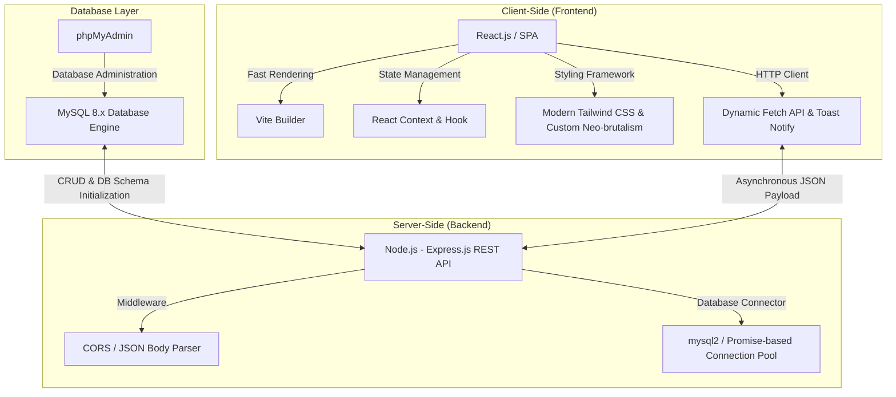
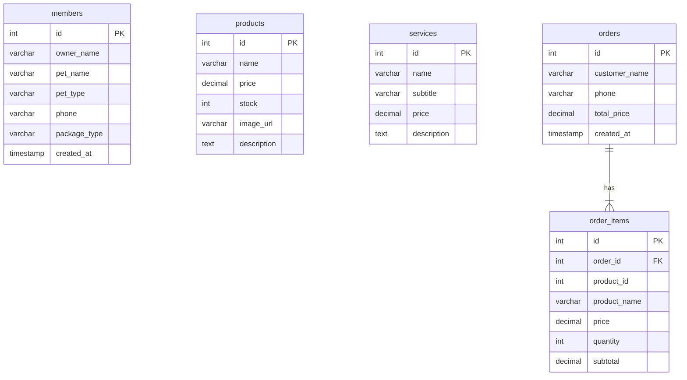

# 🐾 Rifky PawCare Petshop - Premium Full-Stack Web Application

> A modern, clean, and highly robust Petshop Management & E-Commerce Web Application powered by React, Express.js, and MySQL.

---

## 🗂️ Project Overview Card

| Specification        | Details                                                              |
| :------------------- | :------------------------------------------------------------------- |
| **Project Name**     | **Rifky PawCare Petshop**                                            |
| **Category**         | Web Application / Full-Stack Development                             |
| **Developer**        | [Rifky Devs](https://pawcare.rifkydevs.my.id/)                       |
| **Technology Stack** | React.js, Vite, Node.js, Express.js, MySQL, REST API, Tailwind CSS   |
| **Database Engine**  | InnoDB, MySQL 8.x + Connection Pooling                               |
| **Current Status**   | Production Staging & Live                                            |
| **Live Url**         | [https://pawcare.rifkydevs.my.id/](https://pawcare.rifkydevs.my.id/) |

---

## 📝 Tentang Project

**Rifky PawCare Petshop** adalah platform aplikasi web full-stack modern yang dirancang secara khusus untuk memenuhi kebutuhan digitalisasi ekosistem bisnis _petshop_. Platform ini menjembatani kendala operasional tradisional dengan menghadirkan solusi digital menyeluruh—mulai dari eksplorasi produk premium, sistem pemesanan layanan perawatan (_grooming & training_), program keanggotaan pelanggan (_membership_), manajemen keranjang belanja terintegrasi, hingga checkout transaksi secara _real-time_.

Aplikasi ini dibangun dengan paradigma **RESTful API** yang memisahkan arsitektur _frontend_ dan _backend_ secara bersih. Hal ini memastikan performa rendering halaman yang luar biasa cepat melalui optimasi bundler **Vite**, serta menjamin keandalan pemrosesan data sensitif di sisi server menggunakan **Express.js** dan database **MySQL** yang tangguh.

---

## ⚡ Fitur Utama (Core Features)

Setiap fitur dalam PawCare Petshop diimplementasikan dengan fokus pada efisiensi performa, keandalan integritas data, dan kenyamanan pengguna (_User Experience_):

- ### 🛒 Shopping Cart (Keranjang Belanja Interaktif)
  Sistem manajemen keranjang belanja dinamis berbasis _React Context State_. Pengguna dapat menambah, mengurangi quantity, dan menghapus item produk secara instan tanpa perlu memicu muat ulang halaman (_zero-reload_).
- ### 💳 Checkout System (Sistem Order Real-time)
  Alur pemrosesan pesanan yang mulus. Data keranjang belanja diserialisasikan ke dalam skema transaksi database MySQL melalui endpoint API aman, mendukung penyimpanan data relasional ganda (tabel `orders` dan `order_items`).
- ### 🐾 Membership Management (Manajemen Pelanggan Setia)
  Formulir pendaftaran keanggotaan interaktif yang menyimpan detail profil pemilik, nama hewan kesayangan, jenis hewan (_cat, dog, bird, rabbit_), nomor telepon, dan paket membership terpilih untuk program retensi jangka panjang.
- ### 🗄️ MySQL Database (Penyimpanan Data Terstruktur)
  Sistem penyimpanan relasional yang terstruktur rapi untuk menjamin integritas data operasional. Menghubungkan entitas produk, layanan, keanggotaan member, dan item transaksi secara koheren.
- ### ⚡ REST API Server (Komunikasi Data Asinkron)
  Web API mandiri yang dirancang menggunakan Express.js, bertindak sebagai gerbang backend yang aman dan responsif untuk melayani request data dinamis menggunakan metode HTTP standard (`GET`, `POST`).
- ### 📱 Premium & Responsive Design
  UI eksklusif yang dirancang adaptif di seluruh perangkat—mulai dari layar smartphone terkecil, tablet, hingga desktop monitor resolusi tinggi dengan performa layout CSS modern.

---

## 🛠️ Teknologi yang Digunakan

PawCare Petshop dirancang menggunakan arsitektur modern berbasis teknologi JavaScript terpopuler:

### Frontend (Client):

- **React.js (SPA)**: Pustaka utama untuk membangun antarmuka deklaratif berbasis komponen modular yang efisien.
- **Vite**: Alat build super cepat modern untuk menggantikan webpack tradisional, memastikan proses development dan waktu load produksi menjadi optimal.
- **Tailwind CSS & Custom CSS**: Kerangka kerja styling untuk menghasilkan visual premium dengan sistem grid fleksibel dan micro-animations.
- **React Context**: Mengelola global state manajemen untuk keranjang belanja secara lancar tanpa _prop-drilling_.
- **Toast Notifications**: Peringatan UI interaktif waktu-nyata untuk feedback aksi tambah barang, pendaftaran member, dan checkout sukses.

### Backend (Server):

- **Node.js**: Runtime JavaScript untuk menjalankan server backend dengan efisiensi tinggi.
- **Express.js**: Kerangka kerja REST API minimalis dan fleksibel untuk mengamankan routing serta menangani logika data dari client.
- **mysql2/promise**: Pustaka modern yang mendukung koneksi asinkron (_Promise-based_) dan mekanisme **Connection Pooling** untuk menjaga efisiensi penggunaan memori server database.

---

## 🗄️ Backend & Database Architecture

Sistem ini didukung oleh database relasional MySQL dengan relasi data terindeks untuk menjaga keandalan transaksi. Di bawah ini adalah struktur tabel utama beserta hubungannya:

### Detil Skema Tabel MySQL:

1.  **`orders`**: Menyimpan data identitas pesanan (ID transaksi utama, nama pelanggan, nomor telepon, total harga, dan cap waktu pembuatan).
2.  **`order_items`**: Menyimpan relasi rinci dari produk yang dicheckout (ID order utama, ID produk, nama produk, harga satuan saat dibeli, quantity, dan subtotal harga).
3.  **`services`**: Menyimpan daftar layanan grooming terintegrasi, deskripsi program, kategori, dan detail tarif.
4.  **`members`**: Menyimpan data profil member aktif pelanggan petshop untuk proses retensi loyalitas petshop.
5.  **`products`**: Menyimpan persediaan produk petshop, detail harga, stok, deskripsi, dan referensi visual.

---

## 🎨 UI/UX & Design Philosophy

Visual dan interaksi PawCare dirancang agar mampu menghadirkan kesan **premium, intuitif, dan responsif**:

- **Curated Color Palette**: Menolak penggunaan warna dasar kasar. Memanfaatkan kombinasi warna lembut yang berpadu dengan tema modern untuk menumbuhkan kesan terpercaya dan ramah hewan peliharaan.
- **Micro-Animations & Hover Effects**: Penambahan umpan balik visual instan pada saat tombol disorot (_hover_), item dimasukkan ke keranjang, dan transisi antar halaman untuk memberikan pengalaman navigasi yang "hidup".
- **Instant Feedbacks**: Pengintegrasian komponen toast notifications untuk meminimalisasi ketidakpastian aksi pengguna, memvalidasi setiap keberhasilan interaksi seperti registrasi dan pemesanan secara instan.
- **Mobile-First Design**: Struktur navigasi dan tata letak grid disesuaikan dari ukuran terkecil smartphone secara adaptif hingga layar desktop paling lebar tanpa merusak kenyamanan visual.

---

## 🚀 Deployment & Dev Ops

Aplikasi **Rifky PawCare Petshop** telah terpublikasi secara publik di internet dengan konfigurasi performa terbaik:

- **Domain Utama**: [https://pawcare.rifkydevs.my.id/](https://pawcare.rifkydevs.my.id/)
- **Secure Connection (HTTPS)**: Dilengkapi dengan SSL/TLS aktif untuk enkripsi pertukaran data frontend-backend.
- **Optimized Environment**: Environment server backend dikelola dengan variabel lingkungan (`.env`) dinamis untuk merahasiakan kredensial database.
- **Database Admin Tooling**: phpMyAdmin terkonfigurasi untuk memonitor perubahan entitas secara real-time demi mempermudah manajemen stok dan verifikasi order masuk.

---

## 🎯 Tujuan Pengembangan (Engineering Goals)

1.  **Arsitektur decoupled yang bersih**: Memisahkan antarmuka (Vite/React) dengan backend pemrosesan data (Express/MySQL) agar lebih mudah dikembangkan, dimigrasi, atau diskalakan di kemudian hari.
2.  **Efisiensi Query**: Mengimplementasikan SQL Transaction rollback pada endpoint `/api/orders` untuk mencegah redundansi atau kegagalan data parsial jika pesanan gagal disimpan di tengah jalan.
3.  **Optimasi Respons Halaman**: Mengurangi beban loading browser lewat rendering produk dinamis berbasis `Fetch API` sewaktu client membutuhkannya secara asinkron (_lazy fetching_).
4.  **Showcase Kemampuan Full-Stack**: Memvalidasi kemampuan perancangan web dari hulu ke hilir—mulai dari perancangan wireframe UI/UX, penataan CSS dinamis, pemrograman server REST API, hingga normalisasi skema database.

---

  Dibuat dengan dedikasi penuh terhadap kualitas kode dan kepuasan pengguna oleh <strong>Rifky Devs</strong>.

